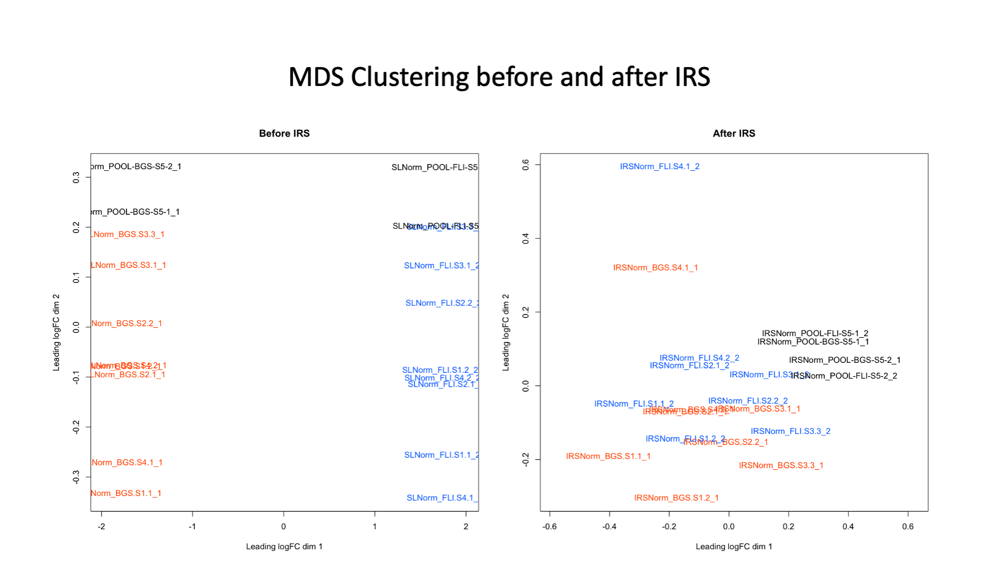
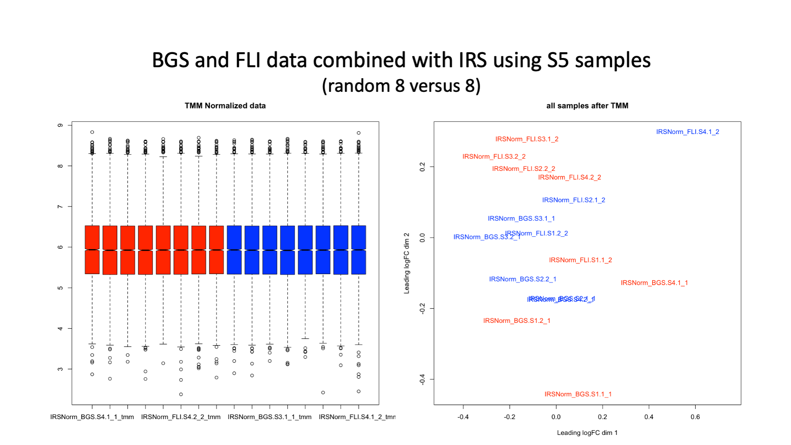
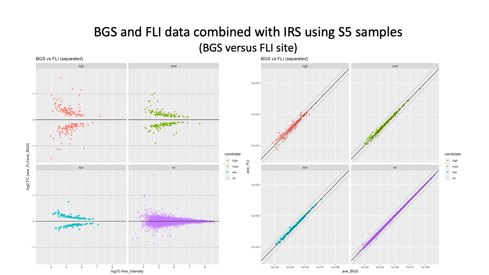

# PXD011691_reanalysis

Reanalysis of data from [PXD011691](http://proteomecentral.proteomexchange.org/cgi/GetDataset?ID=PXD011691) - another DIA versus TMT experiment.

The data is from [this paper](https://pubs.acs.org/doi/abs/10.1021/acs.jproteome.8b00898):

> Muntel, J., Kirkpatrick, J., Bruderer, R., Huang, T., Vitek, O., Ori, A. and Reiter, L., 2019. Comparison of protein quantification in a complex background by DIA and TMT workflows with fixed instrument time. Journal of proteome research, 18(3), pp 1340-1351.

The paper compares 10 single shot DIA runs to a 10-fraction TMT-labeling experiment using biological replicate samples of a mouse brain background. The samples were run in two labs using similar LC and mass spec systems. [Human UPS2](https://www.sigmaaldrich.com/US/en/technical-documents/technical-article/protein-biology/protein-mass-spectrometry/ups1-and-ups2-proteomic) proteins were spiked-in to the mouse background (more on this below).

I would like to thank Michael Steidel for recently reminding me of this paper as a more fair comparison of DIA and TMT quantitative methods. I had grabbed the TMT RAW files way back in October 2019 and processed the data with my Comet/PAWs pipeline. I am guessing that I lost interest in the reanalysis because of the UPS2 proteins (more on that below). A recent [blog-like post](https://github.com/pwilmart/Human-plasma_DIA-vs-TMT) comparing DIA and TMT sparked interest in a revisit of the data.

---

## Contents:
- Disclaimers
- Paper review
- TMT Data
  - Processing overview
  - Proteome depths/overlap
  - Missing data
  - Data quality
  - Controlling false positives
  - Comparison between sites
  - UPS2 spike-in
- DIA Data
  - Try to use similar protein summarization as TMT
  - Use newer DIA Software
  - Similar QC metrics as TMT
- Compare DIA to TMT
  - Still thinking about this
- Conclusions

---

## Disclaimers

No paper is ever 100% right or 100% wrong. I liked many things about the data from this paper. Ten biological replicates of a mouse brain (cerebellum) background was great. I think a lot can be learned from the unchanging background proteins when evaluating data processing and normalizations. Comparing single-shot DIA to a fractionated TMT experiment is a fair way to compare the methods because they use similar total amounts of instrument time. These are also the typical use cases for both quant methods. Another interesting aspect was to run the same sample preparations at two lab sites using very similar instruments and instrument methods.

It takes me several days to perform these reanalyses of published data. Being publicly critical of published work without doing some work yourself is lazy and petty. It is better to pour over the paper and, if there is anything that could have been done better, to demonstrate that better results would have been obtained with the proposed changes. This can seem like a real "Reviewer 2" exercise, but it is not intended to be. The goal is not to single out the paper or its authors in a bad way. The goal is to show (hopefully) better data analysis methods so that the proteomics community can do even better work in the future. This is a tricky "thread the needle" situation and I apologize in advance if any feelings are hurt.

Everything below are my personal opinions.

A comma is used as the thousands separator in numbers below (USA convention).    

---

## Paper Review

I will summarize important positive and negative things from the publication that are directly relevant to the data reanalysis. At this point in time I have done just the TMT data, so I will focus on those parts of the paper now and add more on DIA later. The sample prep seems good. The samples were processed in one lab and the final samples were run on LC-MS platforms at two lab sites (Biognosys (BGS) and Fritz Lipmann Institute (FLI)).  For the TMT samples, the common sample processing involved trypsin digestion, TMT 10-plex labeling, mixing labeled samples, and first dimension fractionation into 10 fractions.

The samples were 10 commercial mouse cerebellum samples (biological replicates). Human UPS2 proteins were spiked in at low levels. There were 5 UPS2 dilutions done in duplicate. The analytical platform had similar LC systems and the same model mass specs (Thermo Orbitrap Fusion Lumos Tribrids). The same instrument method files were used at both sites. DIA and TMT experiments used the Lumos.

DIA data was generated in 10 single shot runs. A 6-fraction DDA analysis of a pooled sample was used for library creation with MaxQuant. DIA data was collected in a 2-hour run with 40 variable width MS2 windows. DIA data was analyzed with Spectronaut Pulsar X in both library and library-free modes. A common mouse Swiss-Prot FASTA file was used for library building or the library-free direct DIA analysis (and for the TMT data analysis).

The TMT data was generated using the SPS-MS3 method on the Lumos Tribrids. Instrument acquisition settings were the same at both sites. The second dimension low-pH reverse runs were 2 hours long. The TMT data was analyzed with Proteome Discoverer v2.2 (PD) using Mascot and the mouse Swiss-Prot FASTA file (about 17K sequences from 2016). Mascot settings were typical narrow (10 ppm) precursor tolerance and 0.5 Da for the ion trap MS2 fragments. Percolator post processing was used for PSM error control. Reporter ions were PD default of signal-to-noise ratios. Minimum peptide length was probably 6 (a PD default). Unique peptides only were used for quant. Some protein inference and error control options in PD (or maybe is was IDPicker post-processing the PSM export from PD?) must have been used but were not detailed.

The sample to TMT channel key was not provided. The main summary tables in the manuscript have reporter ion median values as the protein summary values. I do not think this is an option in PD, so post-processing of the PD lower level data must have been done (details not provided). The PXD011691 repository had the RAW files and the PD MSF files. The MSF files are SQLite3 relational database files and meet the repository requirements. However, MSF files are intermediate files in PD since 2.x and cannot be viewed by newer PD viewers. No details about the PD analysis beyond what was described in the paper could be easily extracted from the SQLite3 file.

Much of the paper presents an analysis of the UPS2 proteins and mostly ignores the mouse background proteins. The UPS2 spike-in was not a great choice. The UPS proteins are human and they have a lot of sequence homology to their respective mouse orthologs. This creates additional shared peptide complications (which the paper addressed). UPS2 has 48 proteins in groups of 8 spanning 5 decades of concentration difference (6 abundance tiers of 8 proteins). On top of the built-in dilutions of UPS2 proteins, the UPS2 proteins were added to the mouse background in 5 different dilutions (just 2 replicates of each dilution). The "dilution squared" effect and overall low levels of UPS2 spike-in proteins resulted in detection of only 12-19 UPS proteins across the DIA and TMT data. The low levels of UPS2 proteins and insufficient replicates for typical statistical analyses made the UPS2 spike-in data of extremely limited utility. I decided to avoid this distraction and focus on the characteristics of the mouse background proteins.

## TMT data Reanalysis

### Processing Overview

Many aspects of the TMT processing in the publication are problematic. Signal-to-noise ratios are not a proper unit of measurement, the mouse Swiss-Prot FASTA file is a bit incomplete, Mascot is not the best choice for ion trap MS2 spectra, and I did not like how the data was summarized for protein level quant. I processed the data through my [Comet/PAWs pipeline](https://github.com/pwilmart/PAW_pipeline) where the wrinkles of TMT data processing have been ironed out in 7+ years of use.

Here are some of the parameter choices and pipeline features that I thought would make improvements:
- more complete FASTA file (21K sequences vs 17K)
- minimum peptide length of 7 amino acids
- [wide precursor tolerance](https://pwilmart.github.io/blog/2021/04/22/Parent-ion-tolerance)
- Comet search engine is more sensitive
- accurate and sensitive PSM FDR control
- two peptide per protein per plex rule for protein ID
- extended parsimony protein grouping
- reporter ion peak heights (intensities)
- reporter ion sums for protein quant values
- integrated missing value handling

> Definition of "plex". A set of samples labeled by one TMT regent kit (6-plex, 10-plex, 11-plex, 16-plex, or 18-plex) is a plex. A plex may be analyzed by one or more LC-MS runs. A TMT experiment may be one or more than one plex. Multiple plexes can be used to accommodate more biological samples than can fit into a single TMT labeling kit.

**Dataset summary numbers**

What|BGS|FLI|PAW BGS|PAW FLI|Gain
---|---|---|---|---|---
MS2 scans|384,156|470,691|384,156|470,691
1% FDR Scans|114,371|125,425|143,285|151,071|23%
PSM ID rate|29.8%|26.6%|37.3%|32.1%
Peptides|65,837|65,633|67,206|68,212|3%
Proteins 2 peptides/protein|5,938|5,837|6,319|6,271|7%

I am not sure that peptide sequence counting was done the same way (I don't usually count peptides). It is clear that the PAW processing identified more PSMs and ultimately more peptides and proteins.

The PAW pipeline splits the FDR analysis into peptide subclasses (deltamass windows, peptide charge states, and peptide modification states) and it can be instrucutve to see what fractions of the PSMs fall into the different subclasses.

Charge|Fraction
---|---
2+|46.6%
3+|45.1%
4+|8.3%

TMT labels shift peptide charge state distribution to higher charges.

Delta Mass Region|Fraction
---|---
0-Da narrow window|88.1%
1-Da narrow window|9.5%
Outside narrow windows|2.4%

Most peptides have very good agreement between measured and predicted masses (0-Da delta masses). There are quite a few PSMs with deamidated Asn and with C13 triggers (nominal 1-Da delta masses). There are also many PSMs with inaccurate masses (this can depend on the instrument method options). Note that I do not measure delta masses in PPM because that has no useful physical meaning to me.

Charge|Fraction with M+16
---|---
2+|18.3%
3+|21.5%
4+|23.2%
All|20.1%

Oxidized Met is an important variable PTM to add due to its prevalence in most sample preps. Note that PSM counts inflate how much sample seems oxidized. Intensity-based estimates would be smaller.

### Proteome Depth and Overlap Between Sites

How you count things when you compare things is of critical importance. If we were to look at the data from each site separately, the PAW pipeline would require two peptides per protein. That would give the protein ID numbers above. When data from multiple TMT plexes are processed in the PAW pipeline, you want to take all of the 1% FDR filtered files and do a collective protein inference. The more PSMs we use, the more information we can bring to the inference logic. This also gives peptide and protein summary files with all of the data in one place (we do not have to merge tables). The protein ID criteria for the combined BGS and FLI data is two peptides per protein **per plex**. Proteins do not have to have 2 peptide in **both** plexes. This relaxes things slightly. The PAW pipeline also removes (zeroes out) some very low intensity reporter ion on a scan basis. We end up with a few proteins that meet the ID criteria but have no associated reporter ion data. We have a few more proteins that we can ID than we can quantify.

> A fractionated TMT plex MS analysis looks like a classic MudPIT experiment of a biological sample. Because the TMT channels are hidden from the search engine and its output processing, there is some equivalence between a TMT plex and a label free "sample". I might unintentionally refer to a TMT plex as a "sample" when I am **not** referring to the TMT channels. 

When we want to talk about proteome depth and overlap between sites, it makes more sense to count quantifiable proteins (we are doing quantitative proteomics, right?). Wait a minute. Since we have quantities for each protein, should we count protein identifications or count by total intensities? We will do it both ways and see. The union of all protein identifications from both sites was 6,796.

Site|Quantifiable Proteins|Average Intensity per Sample
---|---|---
BGS|6,539|19,328,018,191
FLI|6,504|42,620,258,349

We have a few more proteins in the BGS data even though the intensities are less than half compared to the FLI data. Of the proteins seen at each site, how many were unique to that site and how many were seen at the other site?

Site|Quantity|Seen at both sites|Unique to site
---|---|---|---
BGS|Protein Count|6,270|269
BGS|Count Percentages|95.9%|4.1%
BGS|Protein Intensity|19,308,751,470|19,266,721
BGS|Intensity Percentages|99.9%|0.1%
FLI|Protein Count|6,504|234
FLI|Count Percentages|96.4%|3.6%
FLI|Protein Intensity|42,584,284,686|35,973,663
FLI|Intensity Percentages|99.9%|0.1%

We have about 6,800 total protein identifications (after protein grouping and excluding decoys/contamininants), there are about 6,500 identified at each site, and about 6,300 seen in common at both sites. If we count by number of proteins identified rather than number of proteins that are quantifiable, the percentage in the overlap is lower (about 92% (6,300 out of 6,800)). Restricting the counts to quantifiable proteins gets the overlap up to 96% (6,300 out of 6,500), but ID counting inflates low abundance things. When we use quantitative values in the counting, we see that the proteins unique to each site are extremely low abundance (only 0.1% of the intensity total). The vast majority of the signal at each site comes from proteins seen (and quantifiable) at both sites. A common argument for DIA is to remedy the poor reproducibility of identifications and quantifications in DDA experiments. I don't see a problem that needs fixing for this data.

### Missing Data

The BGS data was 6,539 proteins with 10 TMT values per protein for a total of 65,390 values. Of those, there were 31 missing values (0.05%). There were 6,504 proteins with 65,040 total values and 35 missing values (0.05%) for the FLI data. Low missing data is clearly one of the advantages of TMT labeling. There is no missing data problem to worry about either.

### Data Quality

#### Introduction

Global dataset stats and tables of numbers are exciting to me, but others might prefer plots and figures. I completely decouple quantitative data **generation** from quantitative data **analysis**. The data generation in the PAW pipeline is all Python scripts because an actual programming language is better for that kind of data processing. Once properly summarized quantitative data is packaged in well-formed tables, R and Bioconductor tools can be used. Statistical tools and data visualizations are more mature in R compared to Python. Notebooks are an excellent way to bring transparency, reproducibility, and story telling to data analyses. Jupyter notebooks are what I use (RMarkdown is also an alternative).

During the five years I have been analyzing data with notebooks, I have learned a few things. Every experiment is different and flexibility is key. You have to so some homework and understand some of the biology and the experimental design. You need some domain knowledge to inform the data analysis steps. I am not talking about a high level of biological expertise for each experiment you analyze, just enough biology background to understand why the study was designed as such, and to see if there are any positive or negative controls you can leverage in evaluating the data analysis steps. The data generation steps are much simpler, with far fewer choices, than the subsequent data analysis steps. Software that tries to combine data generation and data analysis is usually brought to its knees by the trade offs taken to add some lowest common denominator data analysis framework. You end up with hard to use software that performs poorly.

I have settled on a two notebook data analysis strategy. One notebook looks at dataset quality control metrics to make sure data normalizations worked as intended, that biological groups have the expected characteristics (that biological replicates within groups are similar and that there are some differences between groups), that samples are generally consistent in global properties (there can be many issues that can lead to sample outliers), and seeing the degree of variance in the data (kind of a heads up on what to expect from statistical testing). A series of QC metrics and checks can find issues in the data that would not be obvious in the typical statistical testing steps. These QC steps could be incorporated into a longer statistical testing notebook, but that hinders good data story telling (the story gets too long and complicated). The second notebook can focus on the statistical testing and visualization of differential abundance candidates. Most invesitgators are more interested (sometimes) in statistical testing than QC metrics.    

#### QC metrics

We will first look at the TMT data from each site independently. I created a combined grouped protein summary with all of the runs from both sites to get the best protein inference and to make sure that the quantitative protein data from each site was aligned to the same list of proteins. That summary table was opened in Excel for additional data filtering. There are always some keratins identified that are not automatically mapped to the keratins in the common contaminants. Those get flagged as additional contaminants. There can be other classes of proteins that may or may not be contaminants depending on the samples, such as, hemoglobins and serum albumin. I always double check what proteins should or should not be flagged as contaminants. Excel's column filters make this easy. As I mentioned above, we identify more proteins than we can quantify in DDA methods. Some proteins do not have any quantitative data and need to be excluded. After these decisions about what proteins to quantify and which to exclude are made, the data from each site was packaged into simple tables (saved as tab-delimited text files) for loading into the notebooks. These tables have a column to denote the protein (the accessions) and 10 columns of TMT intensity values. The columns were labeled by sample names instead of TMT tags to make the notebooks easier to understand.

##### TMM normalization

Normalizations are usually needed with these large-scale quantitative datasets. There are many normalization algorithms to choose from and some (only a few) of those are compatible with these types of experiments. I like the [trimmed mean of M-values method](https://genomebiology.biomedcentral.com/articles/10.1186/gb-2010-11-3-r25) that is part of the [edgeR Bioconductor](https://bioconductor.org/packages/release/bioc/html/edgeR.html) package.

> Robinson, M.D. and Oshlack, A., 2010. A scaling normalization method for differential expression analysis of RNA-seq data. Genome biology, 11(3), p.R25.

Boxplots of the log10 protein intensities are one way to evaluate the data before and after normalizations. Good alignment of the distributions (horizontally matched medians, matched interquartile ranges, matched whiskers) is a necessary but not sufficient requirement. You can have great looking boxplots and still have unusable data.

TMM normalization results in better horizontal alignment of data distributions (notches, boxes, and whiskers all line up).

##### Clustering plots

Clustering by biological groups is a powerful way to find batch effects and other issues with your experiment. That makes sense when there are actual biological groups. In this experiment, we have 10 biological replicates of normal mouse brain as a constant background that makes up the bulk of the samples. The human UPS2 proteins are spiked in at such low levels that only 18 of the 48 could be identified. They do not have much effect on the clustering and the views are not so interesting for this experiment.

##### Coefficients of Variance

Coefficients of Variance (CVs) within biological groups is another good metric for evaluating data before and normalizations. We only have one group of 10 samples in practical terms here. The median CV was lowered from 8.8% to 5.8% for the BGS site, and lowered from 8.9% to 6.1% for the FLI data. Animal model systems are used partly because biological variability is reduced. We expect mice data to have lower variability compared to human samples. That said, a 6% CV is very low, even for mice samples. I have worked with brain sample TMT data in the past (both human and mice) and brain samples seem to have lower variability compared to most other tissues.

I have seen many types of samples in the 7+ years of analyzing TMT datasets (all SPS-MS3 acquisition) and have some typical numbers for Cvs. Some types of samples are easier to collect and work with than others when looking at animal and human systems and that is reflected in the CVs.

**Ballpark Median CVs by sample types:** 

Sample Type|Ballpark Median CV
---|---
Technical replicates|3%
Cell Cultures|5-6%
Good animal model samples|Upper single digits
Less easy animal model samples|Low teens
Good human samples|20-30%
Less good human samples|40-60%

##### Sample-to-sample scatter plots

A nearly universal given in these experiments is that the biological replicates within a biological groups should be "similar". What do we mean by similar? We mean that the relative abundance estimates for all proteins should be similar. Sample-to-sample scatter plots of the log10 protein intensities work well to check that. There are scatter plot grid functions in R that make this easy to do. I like the `pairs.panels` function from the `pysch` library. This function makes plots with distribution histograms on the diagonal, scatter plots below the diagonal, and correlation coefficients above the diagonal.

We expect properly summarized and normalized TMT data from a single plex to be very precise. We also expect decent accuracy and dynamic range when using the SPS-MS3 instrument method available on Thermo Orbitrap Tribrid instruments. We have replicate 1 samples of the 5 UPS2 spike-in levels from the BGS data. On the left, we have all proteins (mouse and UPS2); on the right, we have just the mouse background proteins. In the bottom row of the left panel, the handful of proteins above the diagonal trend line are the UPS proteins. They are missing in the bottom row of the right panel were we do not have any UPS2 proteins.

These are similar plots from the FLI data with the replicate 2 samples. The pattern is the same. Note: the correlation coefficient is not a very sensitive metric. We can tell far more with our eyes as to what samples have tighter scatter plots.

Another thing we can do is to average intensities by biological group and do scatter plots of the average vectors. This lets us get a heads up on the statistical testing by seeing which groups are similar or different. We do not have any biological groups in this experiment, so we can compare the sample replicates. We see that the proteomes of technical replicates are very similar. That is true at both sites and whether we have all proteins or just mouse proteins. There are a few proteins off of the diagonal trend line, but the vast majority of the 6,260 proteins are very similar over almost 6 decades of intensity dynamic range.

### Comparison between Sites

#### How do we do that?

IRS (internal reference scaling) can do practically anything, so we will use that. The study design did not have reference channels per se. The same 10 samples were run at both sites, so any of the 10 channels could be considered as reference (or bridge) channels. I picked the two S5 replicates in each plex as the proxies for the IRS channels. The sample key was not presented in the paper or related files. However, the UPS2 levels in the S5 samples made them easy to find. We compute the scaling factors from the average of the S5 channels in each plex. We apply those factors to the other 8 channels in each plex. The scaling factors for the 8 channels and the data from the 8 channels are independent because we did not use any data from the 8 channels to compute the factors. Keep in mind that any uncertainties or errors in the scaling factors derived from the S5 samples directly propagate into the 8 channels collectively. This is why it is recommended to use two reference channels per plex to average and reduce uncertainties in the scaling factors.   

The IRS method was [published in 2017](https://www.mcponline.org/article/S1535-9476(20)32393-8/fulltext). I have a lot of content at [my Github site](https://github.com/pwilmart) that talks about IRS. We will do a quick summary for this data. In the cluster view above, before IRS (left panel) we have the samples clustering by BGS site (left side) or FLI site (right side). After IRS (right panel), the S5 samples in black are clustering together (the **averages** of the two channels per site are now identical). The other samples are no longer stacked on the sides of the plot.

TMT measurements within a plex are very precise because they are measured simultaneously in a single instrument scan. In the left panel above, the top left and bottom right scatter plots are the two S5 biological replicates within each plex. The lower left 4 scatter plots are of samples between plexes. The pseudo-random MS2 sampling creates dramatically different intensities in each plex. Data between plexes cannot be directly compared without IRS. After IRS (right panel), samples within and between plexes look the same. The two scatter plots with the red dots are the same samples measured between the two sites (true technical replicates). They have tighter scatter plots that the other 4 which are biological replicates.

We can look at a few of the other biological samples and see what effect the IRS method (with scaling factors computed only from the S5 samples) had on the data. These are the S1 samples. The effect is similar to what we saw for S5 above. The scatter plots with red dots are the technical replicates from different plexes.

These are the S4 samples. The effect is similar to what we saw for S5 above. The scatter plots with red dots are the technical replicates from different plexes. There are more plots in the actual Jupyter notebooks.

#### Comparison of sites using random group assignments

We outlined how we can combine the data from the two sites using the S5 channels above. Now that we have the data from both sites on a common intensity scale, we can create some statistical testing scenarios and see how the constant mouse background behaves. In the first scenario, we will randomly take 8 of the 16 biological samples to be one group and the other 8 to be the second group. This would mimic a block randomized study where samples from each group would be distributed amongst the plexes.

We see that IRS plus TMM normalization results in nicely aligned box plots (left). The samples in the two groups (one read and the other blue) do not show separate clusters (right panel).

We do not have any statistically significant differential abundance protein candidates after doing an exact test in edgeR. Benjamini-Hochberg multiple testing correction was used. Bar plots of the protein intensity per sample for two proteins are shown on the right. We have little abundance difference between groups.

#### Group assignments by site

It is possible that IRS is an overly aggressive adjustment and that we have artificially removed all true differences. A worst case scenario in study designs is a completely unbalanced study where all of the samples for each group are each in single batches. The TMT 10-plexes done at different sites is one of these unbalanced study cases. We can do IRS on the S5 samples and then compare the samples from each site to each other.

The box plots on the left still look great. We now see that there is some clustering of the samples by site with the BGS samples in red separated a little from the FLI samples in blue.

We have 182 Up candidates in red and 183 Down candidates in blue (MA plot on the left) at an FRD cutoff of 0.05. Many of these have pretty small fold changes and only a few proteins have larger fold changes. The median fold change of the candidates is 1.2. We still have 95% of the proteins that are not statistically significant. The p-value distribution on the right has two distributions: a flat distribution from 0 to 1 from unchanged proteins and a spike in small p-values from putative true DE candidates.

You can make a variety of data plots to highlight candidates in these TMT experiments. Here we have categorized DE candidates by FDR cutoffs (purple > 0.10 teal > 0.05 > moss > 0.01 > orange) and made facet plots in ggplot2. The left panel is based on an MA plot and the right panel is based on a scatter plot.

The protein abundance differences we are seeing from a set of constant background proteins when we grouped samples by site after IRS is likely due to uncertainties/errors in the S5 intensity measurements (what we used as our standards). All of the biological samples in each plex get collectively adjusted the the scaling factor. While IRS may not be perfect, it is hard to imagine any better alternatives. Ratios of biological samples to a reference channel within a plex does not eliminate this issue. The uncertainties in the reference channel propagate into uncertainties in the ratios. The effects are the same. They are easier to see and understand with IRS.

> If you think combining the data from both sites is unnecessarily complex, that might be a fair thought. We can take the data from each site by itself and test for any DE candidates by randomly assigning the samples to two groups of 5. That completely eliminates any complications from IRS. We can then do the same edgeR workup. That yielded zero DE candidates for the BGS site (FDR < 0.05) and one DE candidate for the FLI site (FDR < 0.05). The edgeR analysis results in essentially no false positive DE candidates from the mouse background for more than 6,000 proteins.

### UPS2 spike-in

Okay, what about the UPS2 proteins. I am sure some of you just can't let that go. My reanalysis only picked up 18 of the 48 proteins. I could probably do an analysis in edgeR with just two replicates per spike-in, but it is not very robust. Since my pipeline keeps the data in more natural intensity scales we can compare the total intensity of UPS2 proteins to the total intensity of mouse proteins in each sample. We can compare that to the known spike-in levels.

The sample key (what channel corresponded to what spike-in sample) was not clearly listed in the paper. I ended up ranking UPS2 intensities and assigning spike-in level based on that. There was not much difference between S1, S2 or S3 levels and ranking those may not be 100% certain. S4 and S5 are pretty obvious.

**BGI Site:**

Spike-In|Mouse Intensity|UPS2 Intensity|Fraction|Relative to S1|Known Level
---|---|---|---|---|---
S1|21,248,057,406|25,359,491|0.1193%|100%|100%
S2|19,540,659,979|27,034,648|0.1384%|116%|110%
S3|21,910,409,759|34,782,794|0.1588%|133%|144%
S4|21,502,552,440|43,904,294|0.2042%|171%|272%
S5|21,491,851,488|135,621,796|0.6310%|529%|1006%

**FLI Site:**

Spike-In|Mouse Intensity|UPS2 Intensity|Fraction|Relative to S1|Known Level
---|---|---|---|---|---
S1|46,629,549,203|59,327,416|0.1272%|100%|100%
S2|42,987,989236|65,491,056|0.1523%|120%|110%
S3|48,610,778,705|85,054,043|0.1750%|138%|144%
S4|47,251,367,609|108,671,408|0.2300%|181%|272%
S5|47,769,914,311|333,755,423|0.6987%|549%|1006%

I am not sure if I believe the spike-in data enough to worry about the results. The trend seems okay. The S5 and S4 measured levels are low compared to the known levels. I have seen enough SPS-MS3 data to think it works better than maxing out at 5-fold changes. I will need to see how the DIA data does and revisit this later.

## Map to files in the PAW-TMT_results-files folder

File Name|Description
---|---
BGS-quant-table.txt|Prepped quant data table for BGS TMT data
BGS_peptide_results_9.txt|Detailed PSM-level summary table
FLI-quant-table.txt|Prepped quant data table for FLI TMT data
FLI_peptide_results_9.txt|Detailed PSM-level summary table
MSConvert_GUI_log.txt|RAW file conversion log file
PAW_IRS_log.txt|Combining BGS and FLI data with IRS log file
PAW_protein_grouper.log|Extended parsimony protein grouping log file
PAW_results.log|Basic parsimony protein grouping log file
PAW_table_descriptions_9.txt|Descriptions of the tables written by PAW pipeline
PXD011691_BGS_QC_checks.html|Data quality control checks for BGS TMT data
PXD011691_BGS_QC_checks.ipynb|Data quality control checks for BGS TMT data
PXD011691_FLI_QC_checks.html|Data quality control checks for BGS TMT data
PXD011691_FLI_QC_checks.ipynb|Data quality control checks for BGS TMT data
PXD011691_IRS_QC-checks.html|Data QC for combined BGS and FLI data
PXD011691_IRS_QC-checks.ipynb|Data QC for combined BGS and FLI data
PXD011691_IRS_edgeR-exact-random.html|Statistical testing of mouse background proteins
PXD011691_IRS_edgeR-exact-random.ipynb|Statistical testing of mouse background proteins
PXD011691_IRS_edgeR-exact-site.html|Statistical testing of mouse background proteins
PXD011691_IRS_edgeR-exact-site.ipynb|Statistical testing of mouse background proteins
PXD011691_grouped_protein_summary_TMT_9.xlsx|Sheet for prepping the quantitative data
PXD011691_results_edgeR-exact-random.txt|Results of the testing of mouse background proteins
PXD011691_results_edgeR-exact-site.txt|Results of the testing of mouse background proteins
ThresholdFigures|Folder of delta-mass and conditional score histograms
add_TMT_intensities_log.txt|Protein summarization of reporter ions log file
comet.params|Comet search engine parameters file
grouped_peptide_summary_9.txt|Peptide summary after extended protein grouping
grouped_peptide_summary_TMT_9.txt|Peptide summary after extended protein grouping with reporter ions
grouped_protein_summary_9.txt|Protein summary after extended protein grouping
grouped_protein_summary_TMT_9.txt|Protein summary after extended protein grouping with reporter ions
labeled_grouped_protein_summary_TMT_9.txt|Protein summary after extended protein grouping with sample key
labeled_grouped_protein_summary_TMT_9_IRS_normalized.txt|IRS adjusted TMT data from BGS and FLI data
msn_files_PAW_log.txt|Data filtering (PSM FDR control) log file
peptide_summary_9.txt|Peptide summary after basic protein grouping
protein_summary_9.txt|Peptide summary after basic protein grouping
sqt_conversion_log.txt|Top hit summarization log file

---

Thank you for reading.   Phil Wilmarth   February 21, 2023
